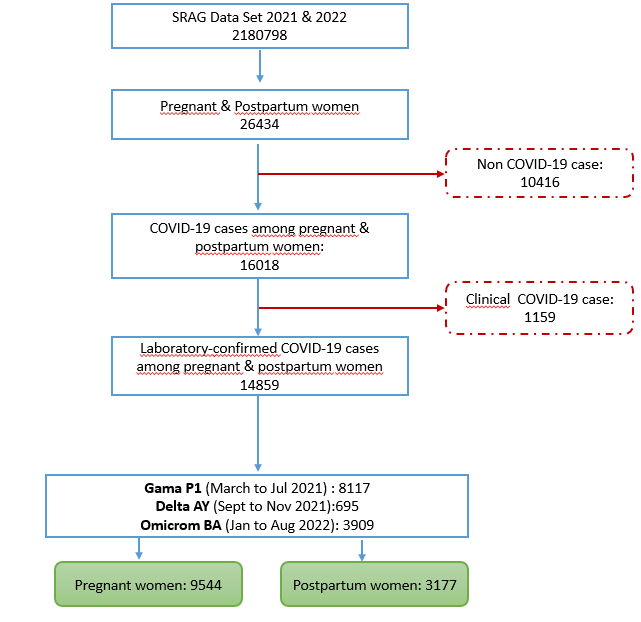
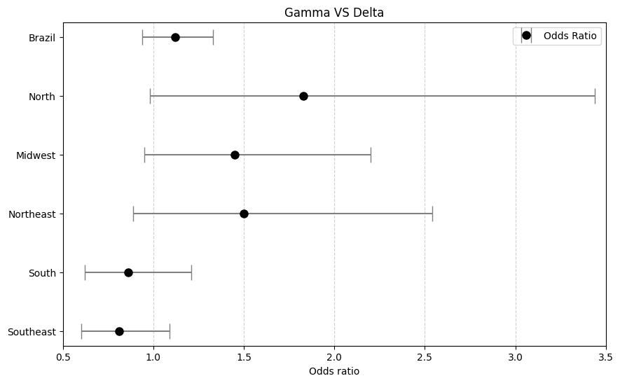
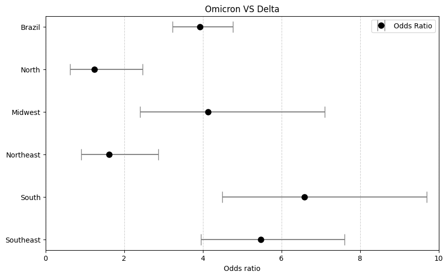
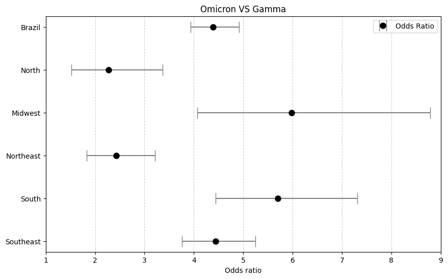

# Analysis-SARS-CoV-2-variants
 The impact of different SARS-CoV-2 variants of concern on maternal outcomes in Brazil.

 By leveraging publicly available data, the study examines how different variants—Gamma, Delta, and Omicron—have impacted pregnant and postpartum women in terms of severe outcomes like ICU admission and mortality.

 This project was accepted for publication at the FIGO Obstetrics & Gynaecology International Conference

 ## Contents
 - [Installation](#installation)
- [Organization](#Organization)
- [Analysis](#Analysis)
- [Conclusion](#Conclusion)

## Installation

The database for this project is public :https://opendatasus.saude.gov.br/dataset/srag-2021-a-2023.
(The analyses carried out do not include updates to the database since 2022.)

As such, the dataset has not been placed in the repository, but the data dictionary is contained in the 'Assets' folder

## Organization

- Firstly, the relevant information about the dataset is set out in 'pre_processing'

- In 'exploratory_Sociodemographic_Obstetrical' and 'exploratory_Clinical features', the relationships between the variables of interest to the research were analyzed.

    **The analysis was also done in Power BI :** 

    https://app.powerbi.com/view?r=eyJrIjoiMThiNjhmNzItMzhiOC00YThhLTk2MzAtZGEyNzQ2MjMyNzg5IiwidCI6IjYxZjNlM2I4LTliNTItNDMzYS1hNGViLWM2NzMzNGNlNTRkNSIsImMiOjh9

- Finally, in 'main', we have the implementation of the Logistic Regression model

## Analysis

The dataset was filtered as follows: 

- Samples should only contain pregnant or postpartum women 
- Only samples in which the pathogen is SARS-COV-19 were selected
- Only samples in which the Covid test was laboratory confirmed were selected

After merging the 2021 and 2022 datasets, the Covid variants were identified by notification date (VOCs predominance period):

- Gama P.1 (March 2021 to Jul 2021);

- Delta AY (Sept 2021 November 2021);

- Omicrom BA (January 2022 aug 2022).

You can better understand data selection with Flowchart:

In 'exploratory_Sociodemographic_Obstetrical' and 'exploratory_Clinical features', the independence of the following features with the covid variant was verified using the chi square test : 

| **Jupyter notebook**      | **Features** | **Explanation**    |  **p-value**  |
|-----------------------------------------|--------------|----------------------------------|--------------------|
| Exploratory Sociodemographic Obstetrical| OUT_MORBI    | Other Risk Factors               | 0.24        |
|                                         | HEMATOLOGI   | Chronic Hematological Disease    | 0.75        |
|                                         | SIND_DOWN    | Down Syndrome                    | 0.09        |
|                                         | NU_IDADE_N   | Age                              | **0**       |
|                                         | GRAVIDEZ     | Pregnancy                        | **0**       |
|                                         | Regiao_nome  | Brazil Region                    | **0**       |
|                                         | HEPATICA     | Chronic liver disease            | 0.12        |
|                                         | NEUROLOGIC   | Neurological Disease             | **0**       |
|                                         | PNEUMOPATI   | Pneumopathy                      | **0.002**   |
|                                         | IMUNODEPRE   | Immunodeficiency or Immunodepression | 0.12    |
|                                         | OBESIDADE    | Obesity                          | **0**       |
|                                         | CS_RACA      | Ethnicity                        | **0**       |
|                                         | CS_ESCOL_N   | Education Level                  | **0**       |
|                                         | GRAVIDEZ     | Pregnancy                        | **0**       |
|                                         | VACINA_COV   | COVID Vaccination                | **0**       |
|                                         | CARDIOPATI   | Chronic cardiovascular disease   | 0.114       |
|                                         | RENAL        | Kidney Disease                   | **0.001**   |
|                                         | ASMA         | Asthma                           | 0.86        |
|                                         | DIABETES     | Diabetes                         | 0.75        |
| Exploratory Clinical Features           | FEBRE        | Fever                            | **0**       |
|                                         | TOSSE        | Cough                            | **0**       |
|                                         | GARGANTA     | Sore Throat                      | **0**       |
|                                         | DISPNEIA     | Dyspnea                          | **0**       |
|                                         | DESC_RESP    | Respiratory Discomfort           | **0**       |
|                                         | SATURACAO    | Oxygen Saturation                | **0**       |
|                                         | DIARREIA     | Diarrhea                         | **0**       |
|                                         | VOMITO       | Vomiting                         | **0**       |
|                                         | DOR_ABD      | Abdominal Pain                   | 0.416       |
|                                         | FADIGA       | Fatigue                          | **0**       |
|                                         | PERD_OLFT    | Loss of Smell                    | **0**       |
|                                         | PERD_PALA    | Loss of Taste                    | **0**       |

In 'main', several logistic regressions were carried out for the outcomes UTI and EVOLUTION, which mean, respectively, the patient's admission to the ICU and the patient's death.

As an example, the dataset was delimited to contain only samples of the gamma and omicrom variant, then only delta and omicrom and finally only gamma and delta, analyzing the odds ratios in these cases, with and without adjusting for variables such as age, gestational period, region, skin color, vaccination status. 

Let's understand the interpretation of one of these cases studied:

**Logistic Regression for Covid Variant (GAMMA VS OMICROM)**

    Exposed group : Patient has the gamma variant

    Non-exposed group : Patient has the omicrom variant

    Event Exposed group : Patient transferred to ICU

    - a : Patient with gamma and transferred to ICU = 2737
    - c : Patient with omicrom and transferred to ICU = 407
    - b : Patient with gamma and not transferred to ICU = 4747
    - d : Patient with omicrom and not transferred to ICU = 3031

    OR = (a*d)/(b*c) = 4,2938

    Therefore, the group of patients with the gamma variant has 4.2938 times the odds of being transferred to the ICU compared to omicron variant patients.

Moreover, a new variable was created, called composite of severe maternal outcomes ('UTI_EVOLUCAO'), which was determined as follows : 

- Individuals who were not admitted to the ICU and died -> UTI_EVOLUCAO = True
- Individuals who were admitted to the ICU and died -> UTI_EVOLUCAO = True
- Individuals admitted to the ICU who did not die -> UTI_EVOLUCAO = True
- Individuals who were not admitted to the ICU and did not die -> UTI_EVOLUCAO = False

This analysis makes it possible to check which cases had at least one of the two outcomes, ICU admission or death, for each region of Brazil:

| Odds Ratio for each region of Brazil - Gamma VS Delta | Odds Ratio for each region of Brazil - Omicrom VS Delta |
|------------------------------------------|------------------------------------------|
| |  

|Odds Ratio for each region of Brazil - Omicrom VS Gamma|
|:---------------------------------------------:|
| |

If we analyze the southeast on the omicrom vs gamma graph, for example, we can conclude that the group of patients with the gamma variant has 4.44 times the odds of being transferred to the ICU or of being dead compared to omicron variant patients.

Finally, we can see the final results of the logistic regression analysis for the association between clinical features of SARS-CoV-2 infection at admission and adverse maternal outcomes:

| Logistic regression Outcome| Symptom     | OR GAMA (95% CI)         | OR DELTA (95% CI)        | OR OMICRON (95% CI)      |  p-value   |
|------------------|-------------|--------------------------|--------------------------|--------------------------|---------------------|
| **Death**               | Fever       | 1.26 (1.08 - 1.48)        | 1.44 (0.72 - 2.86)        | 2.33 (1.56 - 3.48)        | **0**|
|                         | Cough       | 1.17 (0.98 - 1.4)         | 0.94 (0.45 - 1.93)        | 1.74 (1.14 - 2.66)        | **0**|
|                         | Sore Throat | 1.06 (0.87 - 1.28)        | 0.73 (0.31 - 1.71)        | 0.4 (0.22 - 0.73)         | 0.1897|
|                         | Dyspnea     | 3.52 (2.86 - 4.34)        | 3.59 (1.6 - 8.06)         | 10.75 (6.76 - 17.07)      | **0**|
|                         | Respiratory Discomfort   | 2.54 (2.15 - 3.0)         | 3.46 (1.66 - 7.23)        | 8.15 (5.29 - 12.54)| **0**   |
|                         | Oxygen Saturation   | 3.63 (3.04 - 4.33)        | 6.18 (2.83 - 13.53)       | 15.42 (9.86 - 24.13)      | **0**|
|                         | Diarrhea    | 0.84 (0.64 - 1.1)         | 1.31 (0.38 - 4.56)        | 3.2 (1.68 - 6.07)         | 0.2785|
|                         | Vomit      | 0.72 (0.54 - 0.96)        | 2.07 (0.75 - 5.72)        | 1.43 (0.75 - 2.72)        | 0.3068|
|                         | Abdominal Pain     | 0.79 (0.59 - 1.07)        | 1.17 (0.34 - 4.03)        | 1.63 (0.87 - 3.04)        | 0.5219   |
|                         | Fatigue      | 1.04 (0.88 - 1.23)        | 0.88 (0.39 - 2.0)         | 2.19 (1.4 - 3.43)         | **0.0011**   |
|                         | Loss of Smell   | 0.69 (0.54 - 0.87)        | 0.42 (0.13 - 1.42)        | 2.05 (0.92 - 4.57)        | 0.2740   |
|                         | Loss of Taste   | 0.58 (0.45 - 0.75)        | 0.14 (0.02 - 1.02)        | 2.47 (1.16 - 5.29)        | **0.0195**   |
| **ICU admission**       | Fever       | 1.26 (1.12 - 1.41)        | 1.35 (0.92 - 2.0)         | 1.73 (1.33 - 2.24)        | **0** |
|                         | Cough       | 1.38 (1.21 - 1.58)        | 1.01 (0.67 - 1.53)        | 1.24 (0.96 - 1.62)        | **0**|
|                         | Sore Throat    | 0.8 (0.69 - 0.92)         | 0.91 (0.57 - 1.44)        | 0.69 (0.5 - 0.96)         | **0**|
|                         | Dyspnea    | 4.3 (3.71 - 4.97)         | 3.61 (2.37 - 5.5)         | 5.26 (4.02 - 6.88)        | **0**|
|                         | Respiratory Discomfort   | 2.89 (2.56 - 3.27)        | 3.58 (2.38 - 5.37)        | 4.25 (3.26 - 5.55)        | **0** |
|                         | Oxygen Saturation   | 4.01 (3.53 - 4.54)        | 5.36 (3.52 - 8.16)        | 6.79 (5.15 - 8.95)        | **0**|
|                         | Diarrhea    | 0.74 (0.6 - 0.9)          | 0.89 (0.4 - 1.98)         | 1.62 (0.94 - 2.77)        | 0.5713   |
|                         | Vomit      | 0.72 (0.59 - 0.87)        | 1.15 (0.57 - 2.32)        | 1.31 (0.84 - 2.04)        | 0.0971   |
|                         | Abdominal Pain     | 0.7 (0.56 - 0.87)         | 0.81 (0.37 - 1.79)        | 1.34 (0.86 - 2.09)        | **0.0294**   |
|                         | Fatigue      | 1.34 (1.18 - 1.52)        | 1.68 (1.08 - 2.61)        | 2.12 (1.56 - 2.87)        | **0**|
|                         | Loss of Smell   | 0.73 (0.62 - 0.86)        | 0.55 (0.31 - 0.98)        | 0.93 (0.46 - 1.88)        | 0.3793   |
|                         | Loss of Taste   | 0.65 (0.54 - 0.77)        | 0.5 (0.27 - 0.91)         | 0.96 (0.47 - 1.94)        | **0.0224**   |

## Conclusion:  

The Omicron variant was associated with a lower risk of severe maternal outcomes than the Delta and Gamma period predominance era. However,  symptomatic pregnant and postpartum women still have a significant risk of severe maternal outcomes during the Omicron variant era.   Upon admission, the presence of cough, fever, and dyspepsia was found to be associated with worse maternal outcomes, underscoring the significance of complete vaccination and booster administration for this vulnerable population against COVID-19. 